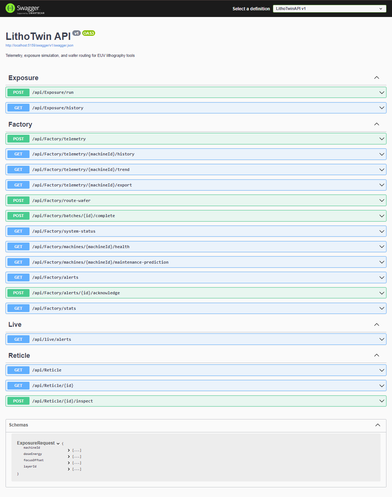
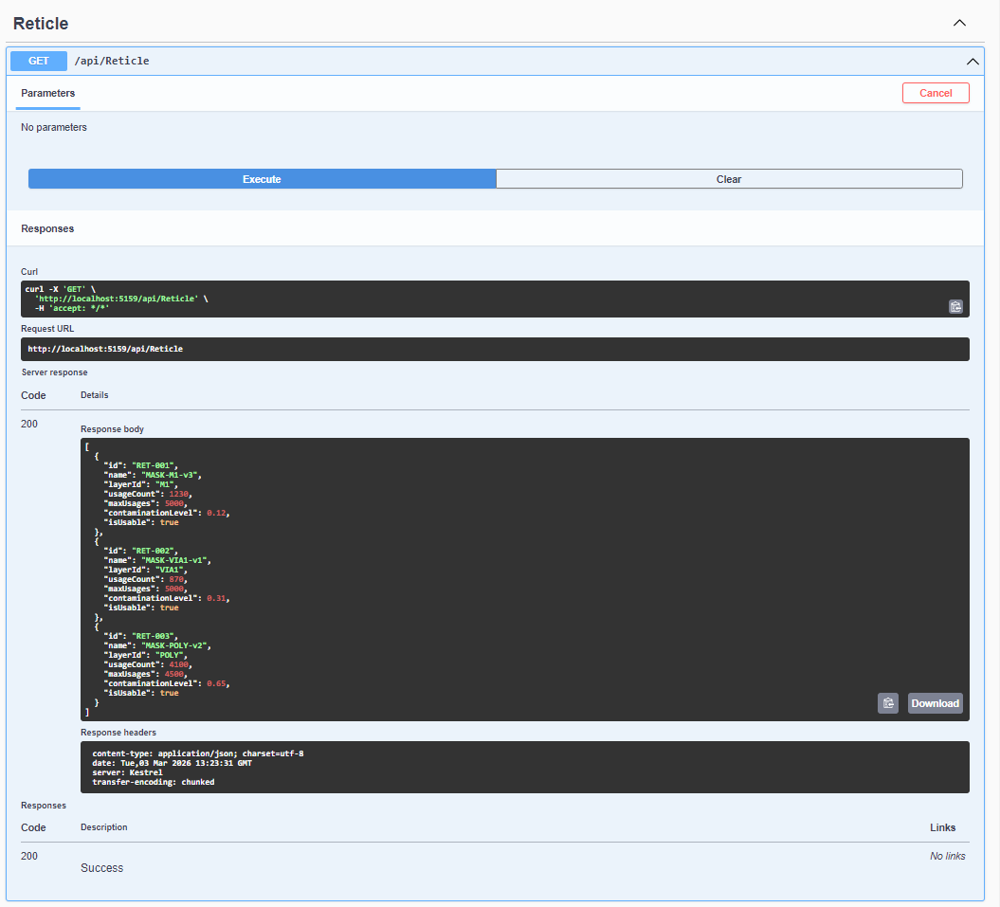
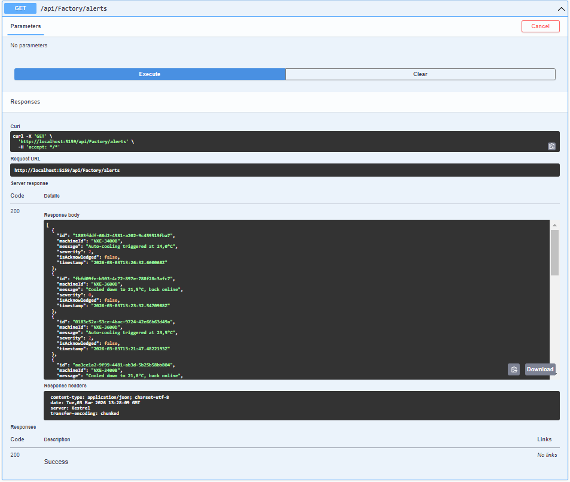

#  LithoTwin API

**REST API that simulates real-time monitoring and control of EUV lithography machines.**  
Built with .NET 7 / ASP.NET Core — telemetry, thermal management, exposure simulation, and predictive maintenance for a virtual semiconductor fab.

> Think of it as a digital twin for ASML-style lithography tools: machines heat up, batches get routed, overlays drift, and the system reacts autonomously.

---

## What You're Looking At

It's a "living" API. A background service (`ThermalDriftService`) constantly heats up the machines based on usage.
If you send a `POST /exposure` request to a machine that is too hot, the physics engine calculates an overlay error (nanometers of drift) and fails the batch.

<p align="center">
  
</p>

## Some Examples:
GET Reticle

<p align="center">
  
</p>


---

## Key Features & .NET Patterns Used

###  Telemetry + Thermal Control
- Ingest temperature readings, trigger **automatic cooling on overheat** with 2°C hysteresis
- Background `ThermalDriftService` (`BackgroundService`) keeps machines "alive" with simulated temperature changes
- **Trend detection** on recent readings (rising / falling / stable)

```
GET /api/factory/machines/NXE-3400B/health
```
```json
{
  "machineId": "NXE-3400B",
  "overallScore": 62.2,
  "comment": "running warm, keep an eye on it",
  "breakdown": {
    "temperature": { "score": 33.9, "weight": 0.5, "detail": "21.6°C / 24.0°C" },
    "uptime":      { "score": 76.1, "weight": 0.2, "detail": "1248h" },
    "state":       { "score": 100,  "weight": 0.3, "detail": "Active" }
  }
}
```

###  EUV Exposure Simulation
- Simulated exposures with dose/focus parameters → computed **overlay error** based on thermal state
- Overlay model: `0.08 nm/°C` thermal expansion + focus penalty + random noise
- Alerts if overlay exceeds the 1.5nm spec limit

```
POST /api/exposure/run
{ "machineId": "NXE-3400B", "doseEnergy": 30, "focusOffset": 0.5, "layerId": "M1" }
```

###  Smart Wafer Routing
- Wafer batches auto-assigned to the **coldest active machine** (max thermal headroom)
- If no machines available → batch rerouted + system alert
- Full batch lifecycle: created → processing → completed

###  Predictive Maintenance
- Maintenance forecast based on uptime cycles + **overlay drift monitoring**
- If recent exposures show degrading overlay → urgency bumped automatically

```
GET /api/factory/machines/NXE-3400B/maintenance-prediction
```
```json
{
  "machineId": "NXE-3400B",
  "estimatedHoursUntilMaintenance": 752,
  "urgency": "not_due",
  "overlayDegrading": false
}
```

###  Live Alerts (SSE)
- Server-Sent Events endpoint streams alerts in real time — open in browser and watch events flow
- Overheat, cooling, overlay violations, routing failures

<p align="center">
  
</p>

###  Factory Stats

```
GET /api/factory/stats
```
```json
{
  "machines": { "total": 3, "active": 2, "cooling": 0, "maintenance": 1 },
  "production": {
    "totalExposures": 175710,
    "totalWafersProcessed": 7028,
    "avgTemperature": 22.3
  }
}
```

---

## .NET Patterns Demonstrated

| Pattern | Where |
|---------|-------|
| **Dependency Injection** | `IManufacturingService` → `ManufacturingService` via `AddScoped` |
| **BackgroundService** | `ThermalDriftService` — long-running thermal simulation with scoped DB access |
| **EF Core InMemory** | `AppDbContext` with seed data (3 ASML machines + 3 reticles) |
| **Repository / Service Layer** | Controllers are thin, all logic lives in `ManufacturingService` |
| **Server-Sent Events** | `LiveController` — manual SSE with `text/event-stream` |
| **Async/Await** | Full async pipeline, controllers → services → EF Core queries |
| **Exception → HTTP mapping** | `KeyNotFoundException` → 404, `InvalidOperationException` → 409 |
| **Swagger / OpenAPI** | Auto-generated docs via Swashbuckle |
| **xUnit Testing** | 17 tests covering core business logic |

---

## Architecture

```
Controllers/
├── FactoryController      telemetry, routing, health, stats, maintenance
├── ExposureController     exposure simulation with overlay model
├── ReticleController      reticle CRUD + contamination tracking
└── LiveController         SSE real-time alert stream

Services/
├── ManufacturingService   core business logic (~400 lines)
└── ThermalDriftService    BackgroundService — simulates thermal drift

Data/
└── AppDbContext            EF Core InMemory, seeded with ASML machine models

Models/
├── Machine                state machine (Active → Cooling → Active)
├── WaferBatch             batch lifecycle tracking
├── ExposureResult         overlay error X/Y + pass/fail
├── TelemetryReading       temperature time series
├── Alert                  severity levels + acknowledgment
└── Reticle                contamination + usage tracking
```

Seeded machines: `NXE-3400B`, `NXE-3600D` (active), `TWINSCAN-EXE` (maintenance).

---

## Quick Start

```bash
dotnet run
# → Swagger UI at http://localhost:5159/swagger
```

```bash
dotnet test LithoTwinAPI.Tests
# → 17 tests passing
```

## Stack

- .NET 7 / ASP.NET Core
- Entity Framework Core (InMemory provider)
- xUnit
- Swashbuckle (Swagger / OpenAPI)
- BackgroundService for thermal simulation
- Server-Sent Events for live monitoring

---

## All Endpoints

<details>
<summary>Click to expand full endpoint list</summary>

### Factory (`/api/factory`)

| Method | Route | Description |
|--------|-------|-------------|
| `POST` | `/telemetry?machineId=X&temperature=Y` | Push temperature reading |
| `GET`  | `/telemetry/{machineId}/history?count=50` | Temperature history |
| `GET`  | `/telemetry/{machineId}/trend` | Trend detection |
| `GET`  | `/telemetry/{machineId}/export` | CSV download |
| `POST` | `/route-wafer` | Assign wafer batch |
| `POST` | `/batches/{id}/complete` | Complete batch |
| `GET`  | `/system-status` | All machines |
| `GET`  | `/machines/{machineId}/health` | Health score |
| `GET`  | `/machines/{machineId}/maintenance-prediction` | Maintenance forecast |
| `GET`  | `/alerts` | Active alerts |
| `POST` | `/alerts/{id}/acknowledge` | Acknowledge alert |
| `GET`  | `/stats` | Factory stats |

### Exposure (`/api/exposure`)

| Method | Route | Description |
|--------|-------|-------------|
| `POST` | `/run` | Run exposure simulation |
| `GET`  | `/history?machineId=X` | Exposure history |

### Reticle (`/api/reticle`)

| Method | Route | Description |
|--------|-------|-------------|
| `GET`  | `/` | List reticles |
| `GET`  | `/{id}` | Reticle detail |
| `POST` | `/{id}/inspect` | Simulate inspection |

### Live (`/api/live`)

| Method | Route | Description |
|--------|-------|-------------|
| `GET`  | `/alerts` | SSE stream |

</details>
